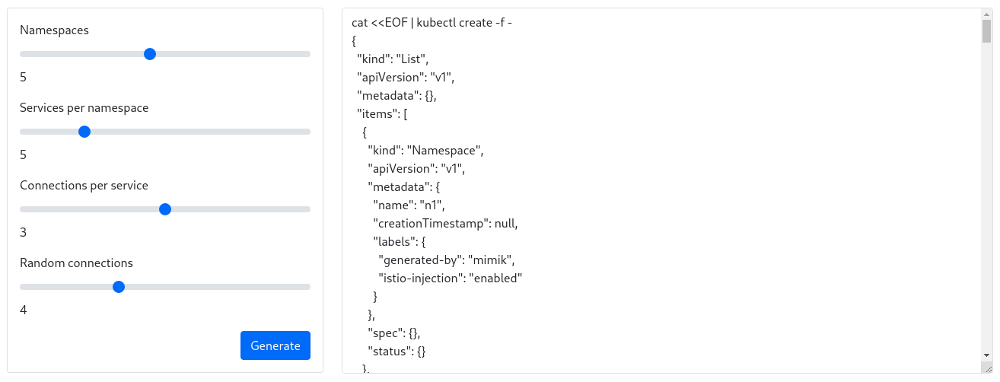

# Topology Generator

The generator creates a topology based on different instances of the same application called Mimik. 

Basically what Mimik does is to imitate a service that listens to certain paths and methods, and connects these with upstream connections (that usually are Mimik instances too) forming a service mesh.

The topology is generated based on some parameters like:

* Number of namespaces
* Number of services per namespace
* Number of connections between services in the same namespace
* Number of random connections between services in different namespaces

## Details

You can refer to [docs](doc/commands/topogen.md) to learn how to use topology-generator.

## Platform Install

This demo has been tested using [Minikube](https://istio.io/latest/docs/setup/platform-setup/minikube/) and [Istio 1.12](https://istio.io/latest/docs/setup/getting-started/#install).

## Application Install

Create the application resources:

```bash
kubectl create ns topology-generator
kubectl apply -n topology-generator -f https://raw.githubusercontent.com/kiali/demos/master/topology-generator/deploy/generator.yaml 
```

## Demo Design

This demo exposes a web application where with some parameters, a command is produced to be executed in the terminal against any cluster:



Visit the application through a proxy:

```bash
kubectl port-forward svc/topology-generator 8080:8080 -n topology-generator
```

Configure the parameters, click on "Generate", copy the command and execute it in a terminal.

As a result, the topology will be created to be observed and managed by Kiali:


## Cleanup

Delete all namespaces generated by the application:

```bash
kubectl delete ns --selector=generated-by=mimik
```

Delete the topology generator:

```bash
kubectl delete ns topology-generator
```
